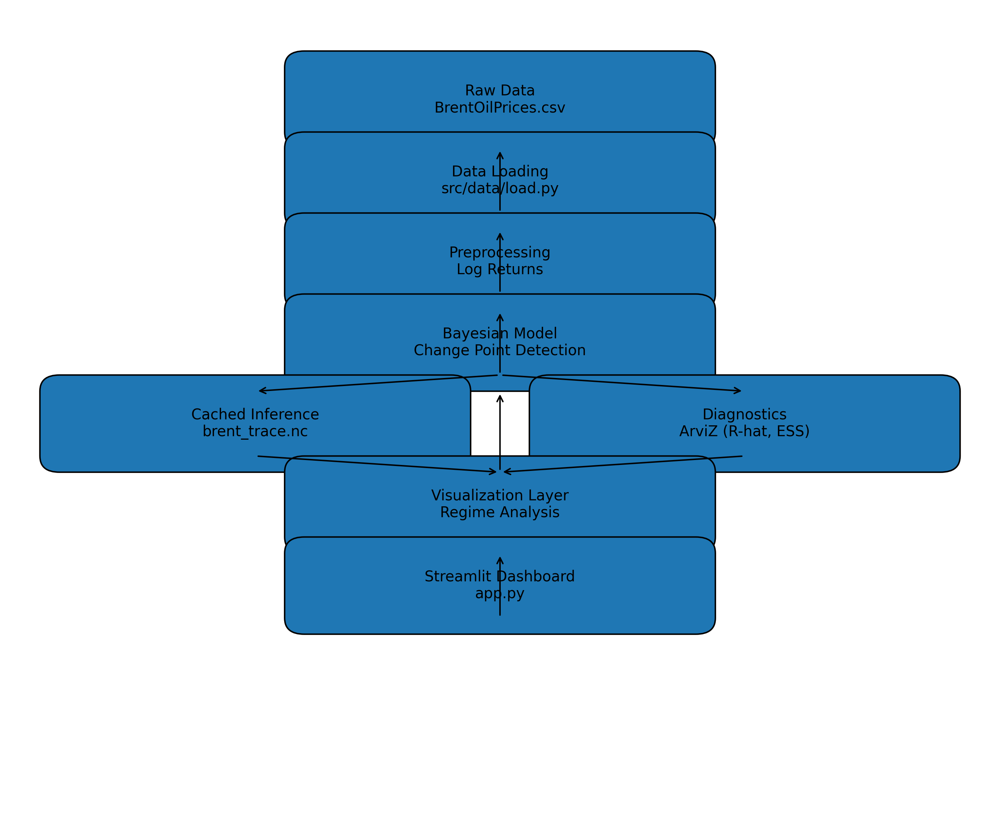

# Brent Oil Structural Break Analysis

Bayesian Change Point Detection & Interactive Dashboard

## Short Description

This project applies Bayesian change point detection to identify structural breaks in Brent crude oil prices. It combines probabilistic modeling, statistical diagnostics, and an interactive Streamlit dashboard to detect and interpret regime shifts in oil market dynamics.

## Business Problem

Oil price volatility significantly impacts:

- Energy companies

- Governments

- Investors

- Supply chain planning

- Inflation forecasting

Unexpected structural breaks in oil price behavior can lead to:

- Mispricing risk

- Poor hedging decisions

- Incorrect forecasting models

- Financial losses

Traditional time-series models assume stable statistical properties. However, oil markets are subject to geopolitical shocks, economic crises, and supply disruptions that fundamentally alter price dynamics.

The challenge:
Detect when the underlying price-generating process changes.

## Solution Overview

This project implements Bayesian change point detection to:

1. Model Brent oil log returns.

2. Estimate the posterior distribution of a structural break.

3. Quantify uncertainty in the detected switchpoint.

4. Compare pre- and post-regime behavior.

5. Visualize results through an interactive dashboard.

Inference results are cached to ensure computational efficiency.

An executive-friendly dashboard communicates findings clearly.

## Key Results

- Identified statistically significant structural break in Brent oil price dynamics.

- Quantified posterior uncertainty around regime shift.

- Demonstrated measurable differences in:

     - Mean price levels (pre vs post regime)

     - Volatility (standard deviation of log returns)

- Reduced re-computation time by caching model inference (NetCDF storage).

- Improved project reliability with automated testing and CI integration.

(Note: Exact numerical values depend on selected sample size in dashboard.)

##  Quick Start

git clone https://github.com/your-username/brent-oil-change-point
cd brent-oil-change-point
pip install -r requirements.txt
python -m src.main
streamlit run app.py

Run tests:
pytest

## Project Structure

brent-oil-change-point/
│
├── app.py                     # Streamlit dashboard
├── requirements.txt
├── README.md
├── .gitignore
│
├── data/
│   └── raw/
│       └── BrentOilPrices.csv
│   └── processed 
│        └── changepoints.json
│   └── external 
│        └── oil_market_events.csv
│
├── models/
│   └── brent_trace.nc         # Cached inference
│
├── notebooks/
│   └── task-1_eda_and_time_series_properties.ipynb
│   └── tasl_2_change_point_analysis.ipynb
│
├── plots/
│
├── reports/
│   └── change_point.png
│
├── src/
│   ├── analysis/
│       └── event_analysis.py
│
│   ├── config/
│       └── settings.py
│
│   ├── data/
│       └── load.py
│       └── preprocess.py
│
│   ├── models/
│       └── change_point.py
│
│   ├── visualization/
│       └── plot_change_point.py
│
│   └── main.py
│
└── tests/
    ├── test_data.py
    └── test_model.py

## Demo

Local Demo:
streamlit run app.py

Dashboard includes:

- Executive summary

- Structural break visualization

- Posterior distribution of change point

- Regime comparison (mean & volatility)

- Event overlay (2008 crisis, 2014 oil crash, COVID shock)

- Model diagnostics (R-hat, ESS)

(Insert GIF or Streamlit deployment link here once deployed.)

## Technical Details
### Data

- Source: Historical Brent crude oil price data.

- Preprocessing:

     - Date parsing

     - Sorting by time

     - Log return computation

### Model

Bayesian change point model using PyMC.

Key components:

- Likelihood: Normal distribution on log returns

- Switchpoint parameter inferred via MCMC

- Posterior sampling using NUTS

- Diagnostics via ArviZ

Inference is cached using NetCDF to prevent repeated sampling.

### Evaluation

Model quality assessed using:

- R-hat (convergence diagnostic)

- Effective Sample Size (ESS)

- Posterior distribution stability

- Regime-level statistical comparison

### 🏗 System Architecture

## Future Improvements

With more time, I would:

- Deploy publicly on Streamlit Cloud

- Add multi-change-point detection

- Incorporate macroeconomic covariates

- Enable automatic PDF export of analysis

- Improve dashboard theming and responsiveness

- Add scenario simulation tools

## Technical Report

Full technical report available here:
[Brent Oil Structural Break Report (PDF)](reports/Brent_Oil_Structural_Break_Report.pdf)

## Author

Bitaniya Geremew
Software Engineering Graduate
Aspiring AI & Data Engineer

LinkedIn: linkedin.com/in/bitaniya-geremew-a327b3258
GitHub: https://github/BitaniaG
Email: bitaniyageremew1@gmail.com